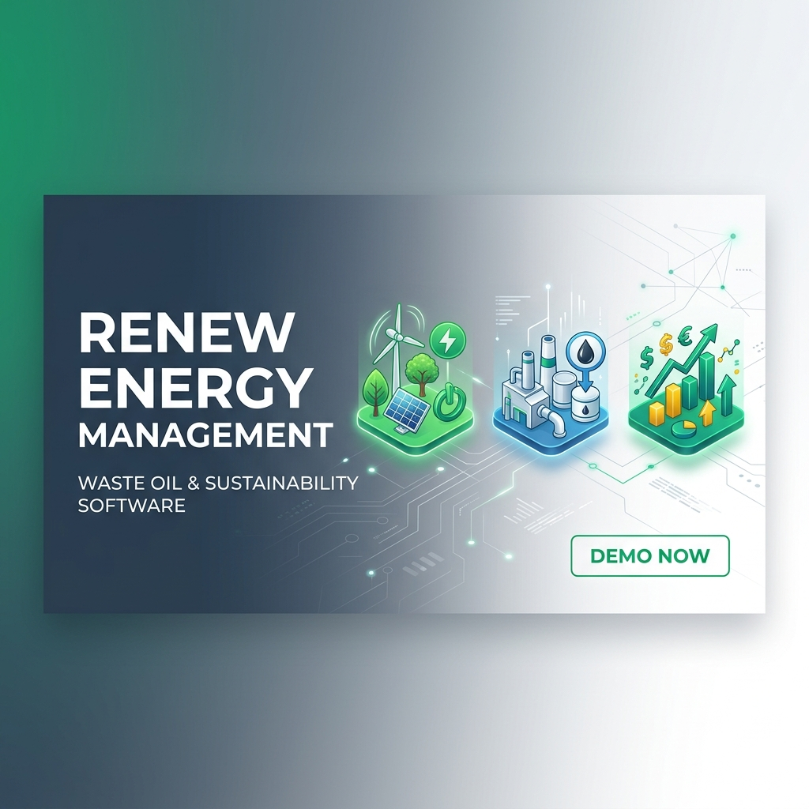
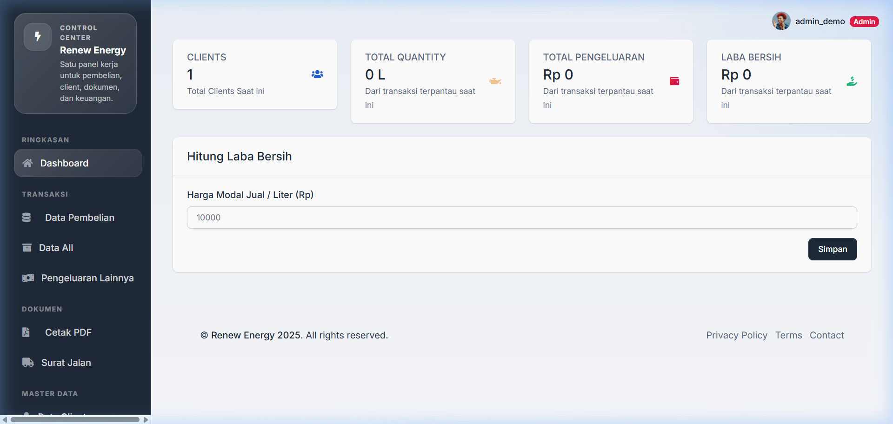
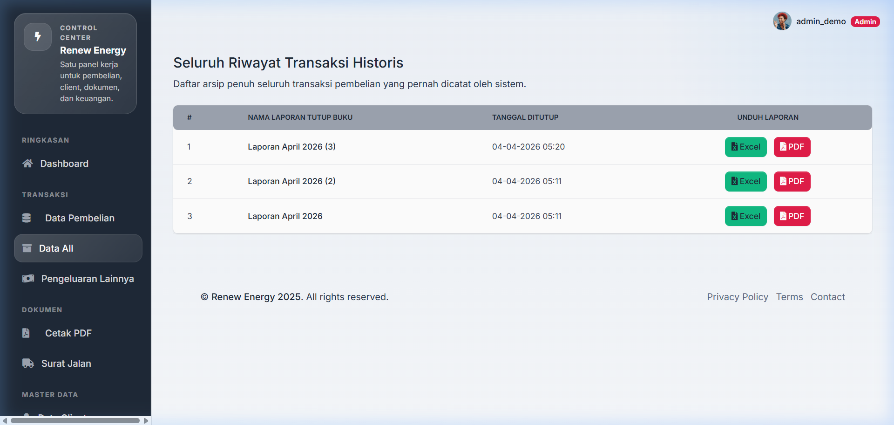

# Renew Energy Workspace 🌿
> **Sistem Manajemen Limbah Minyak Terintegrasi untuk Masa Depan Energi Terbarukan.**



[](https://www.python.org/)
[](https://flask.palletsprojects.com/)
[](LICENSE)
[](https://GitHub.com/Hammmzl/Aplikasi-manajemen-renew-energy/graphs/commit-activity)

**Renew Energy Workspace** adalah aplikasi berbasis web yang dirancang khusus untuk mengelola operasional bisnis pengumpulan limbah minyak (Waste Oil). Aplikasi ini membantu admin dalam memantau pembelian, pengeluaran, hingga penutupan buku keuangan bulanan secara otomatis dan akurat.

---

## ✨ Fitur Unggulan

- 📊 **Dashboard Real-time**: Pantau laba bersih, volume barang (QTY), dan total pengeluaran secara instan.
- 🔒 **Sistem Tutup Buku**: Kunci transaksi aktif Anda dan pindahkan ke arsip permanen dengan sekali klik.
- 📁 **Arsip Laporan (Data All)**: Riwayat transaksi terorganisir per periode dengan fitur cetak laporan.
- 📄 **Ekspor Laporan Canggih**: Generate laporan profesional dalam format **PDF** dan **Excel (XlsxWriter)** dengan styling premium.
- 👥 **Manajemen Client**: Database terpusat untuk seluruh pengepul dan penyuplai minyak.
- 🔐 **Multi-level Access**: Pembagian hak akses antara Admin dan User (Staff).

---

## 🎨 Tampilan Aplikasi

````carousel

<!-- slide -->

````

---

## 🚀 Teknologi yang Digunakan

- **Backend**: Python 3.13 / Flask
- **ORM**: SQLAlchemy
- **Database**: MySQL / SQLite
- **Exports**: WeasyPrint (PDF), XlsxWriter (Excel)
- **Frontend**: Volt Dashboard (Bootstrap 5)

---

## 🛠️ Panduan Instalasi (Lokal)

1. **Clone Repository**
   ```bash
   git clone https://github.com/Hammmzl/Aplikasi-manajemen-renew-energy.git
   cd Aplikasi-manajemen-renew-energy
   ```

2. **Setup Virtual Environment**
   ```bash
   python -m venv venv
   source venv/bin/activate  # atau venv\Scripts\activate untuk Windows
   ```

3. **Install Dependensi**
   ```bash
   pip install -r requirements.txt
   ```

4. **Konfigurasi Database**
   ```bash
   flask db upgrade
   ```

5. **Jalankan Aplikasi**
   ```bash
   python run.py
   ```
   Aplikasi akan berjalan di `http://127.0.0.1:5000`

---

## ☕ Dukung Pengembangan

Jika proyek ini bermanfaat bagi Anda, pertimbangkan untuk memberikan apresiasi atau donasi untuk mendukung pengembangan lebih lanjut:

- 💰 **Saweria**: [https://saweria.co/hammmzl](https://saweria.co/hammmzl) *(Placeholder)*
- ☕ **Buy Me a Coffee**: [https://buymeacoffee.com/hammmzl](https://buymeacoffee.com/hammmzl) *(Placeholder)*
- 💳 **PayPal**: [https://paypal.me/hammmzl](https://paypal.me/hammmzl) *(Placeholder)*

> [!NOTE]
> Link di atas adalah placeholder. Silakan ganti dengan link profil donasi Anda yang asli di file `README.md`.

---

## 📜 Lisensi

Didistribusikan di bawah **MIT License**. Lihat `LICENSE` untuk informasi lebih lanjut.

---

**Dibuat dengan ❤️ oleh [Hammmzl](https://github.com/Hammmzl)**